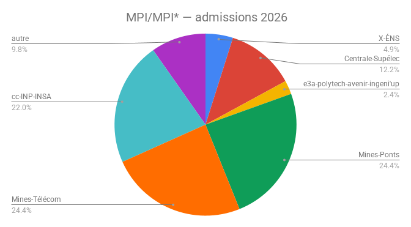
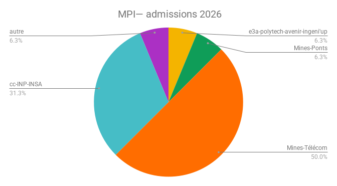
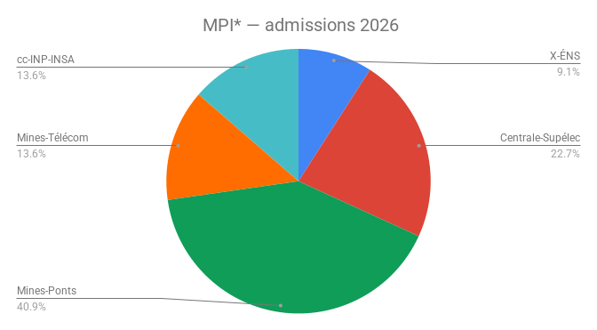

### Documents pour l'organisation de la classe 

- L'[emploi du temps](https://docs.google.com/spreadsheets/d/e/2PACX-1vS-ppiF3kKnXmENWQLQpDe3BKJFvrjyzfgG0-VDzipfNWGo-Ozry_O8EccssJpZF0K_M_gIGjyNK9ax/pub?output=pdf)

### Documents d'information 

- Les [coefficients aux concours](https://docs.google.com/spreadsheets/d/e/2PACX-1vRJw73Hi81u6bFUAYMBH5CtydcVtcj6mt2Ah30TuyQEGA6kCZEwDsogIzeAFjVgfY1EJCg9d-XJsb2g/pubhtml)

### Les résultats de l'an dernier

!
!
!
